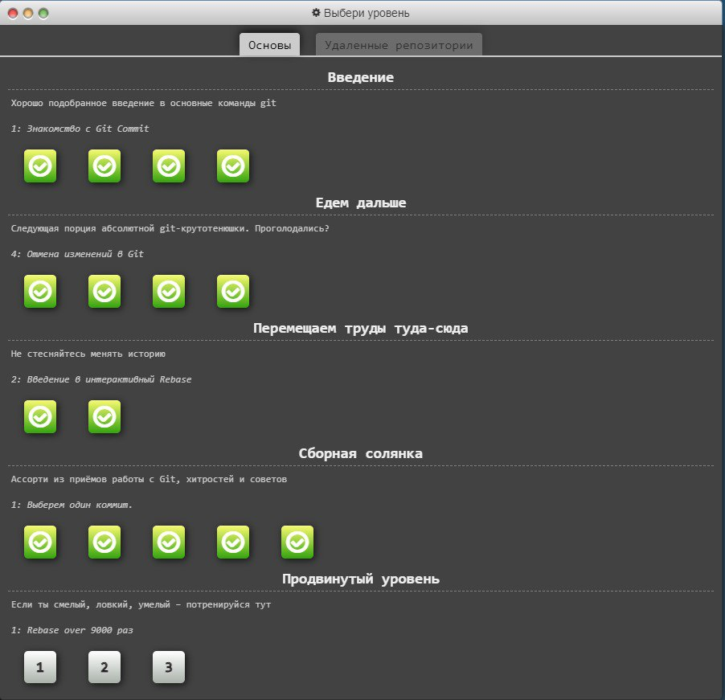
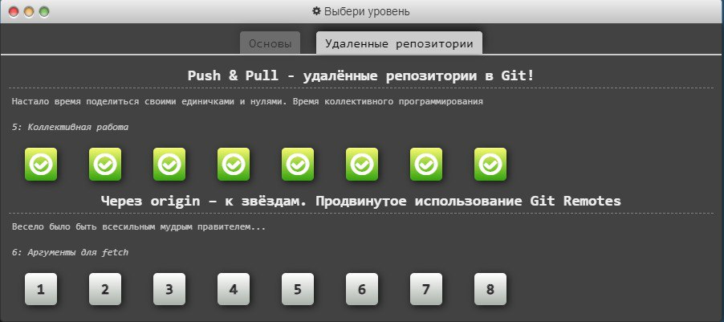
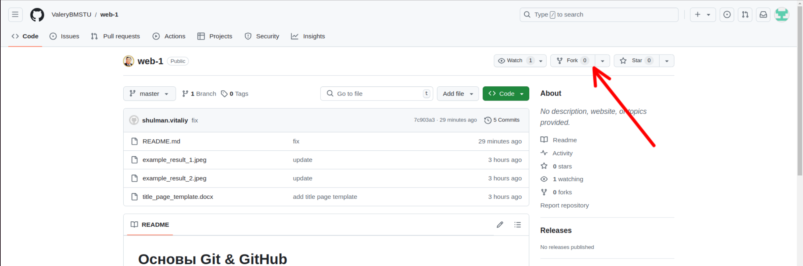
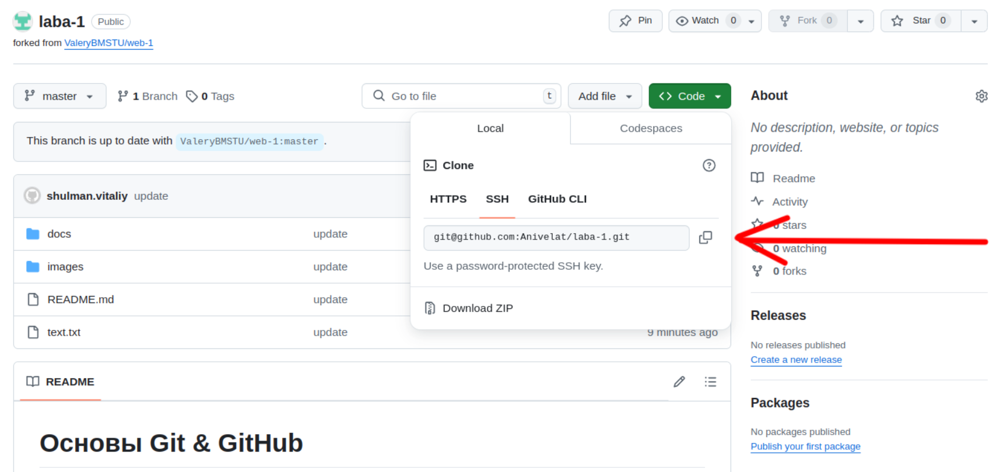

# Основы Git & GitHub

Цель работы — знакомство с системой контроля версий Git, получение и закрепление практических навыков упраления git-репозиторием с помощью базовых команд.

В рамках данной лабораторной работы предлагается освоить git - один из базовых инструментов любого разработчика.

Все лабораторные работы рекомендуется выполнять на операционных системах семейства Linux / Mac OS. При выполнении лабораторных работ на Windows могут возникать дополнительные сложности с настройкой используемых инструментов, а корректность работы приводимых примеров кода не гарантируется. 

## Основные теоретические сведения

Git - это консольная утилита, для отслеживания и ведения истории изменения файлов, в вашем проекте. Чаще всего его используют для кода, но можно и для других файлов. Например, для картинок - полезно для дизайнеров.

С помощью Git-a вы можете откатить свой проект до более старой версии, сравнивать, анализировать или сливать свои изменения в репозиторий.

Репозиторием называют хранилище вашего кода и историю его изменений. Git работает локально и все ваши репозитории хранятся в определенных папках на жестком диске.

Так же ваши репозитории можно хранить и в интернете. Обычно для этого используют GitHub.

Чтобы освоить механики гита, рекомендуется ознакомиться с курсом https://learngitbranching.js.org/?locale=ru_RU. Достаточно выполнить задания во всех разделах, кроме "Продвинутый уровень" в закладке "Основы" и "Через origin – к звёздам. Продвинутое использование Git Remotes" в закладке "Удаленные репозитории". В конечном итоге должна иметь место следующая картина:

 

 

 Также в ходе выполнения лабораторной работы можно и нужно использовать справочник по гиту: https://git-scm.com/book/ru/v2

## Порядок выполнения

Приведенные ниже примеры команд протестированы на Ubuntu 22.04.4 LTS

1. Установите утилиту Git: https://git-scm.com/book/en/v2/Getting-Started-Installing-Git
2. Следуя инструкции https://dev.to/joshhortt/how-to-generate-and-add-an-ssh-key-to-github-1fe1, зарегистрируйтесь на https://github.com, сгенерируйте ssh-ключ и положите его в ваш личный кабинет  
3. Далее, вам необходимо сделать свою собственную копию репозитория с данной лабораторной работой. Черзе интерфейс GitHub cделайте Fork текущего репозитория

 

4. Cклонируйте форкнутый репозиторий на свою локальную машину по ssh с помощью команды `git clone git@github.com:<адрес вашего репозитория>.git` и перейдите в соответствующую директорию

 

5. Создайте локально от ветки master ветку dev и переключитесь на неё с помощью команды `git checkout -b dev`
6. Модифицируйте файл text.txt, заменив слово "world" на ваше имя, после чего проиндексируйте изменения с помощью команды `git add ./text.txt` и зафиксируйте изменения с помощью команды `git commit -m "hello"`
7. По аналогии с предыдущим шагом, добавьте отчёт по лабораторной работе в директорию docs в формате pdf (шаблон титульника находится там же)
8. Запушьте локальную dev-ветку в свой удаленный репозиторий GitHub с помощью команды `git push origin dev` и создайте Pull request из dev в master с помощью интерфейса GitHub
9. Продемонстрируйте результаты в ходе защиты лабораторной работы

## Содержание отчета

1. Титульный лист
2. Цель работы
3. Задание
4. Ход работы со скриншотами и листингами результатов
5. Заключение
6. Список использованных источников 

## Контрольные вопросы

1. В чём разница между Git и Github?
2. Как можно объединить несколько коммитов в один коммит?
3. Для чего нужен git rebase, если есть git merge?
4. Опишите назначение комманд: clone, add, pull, commit, push, merge, rebase
5. Как локально создать Git-репозиторий с нуля?

